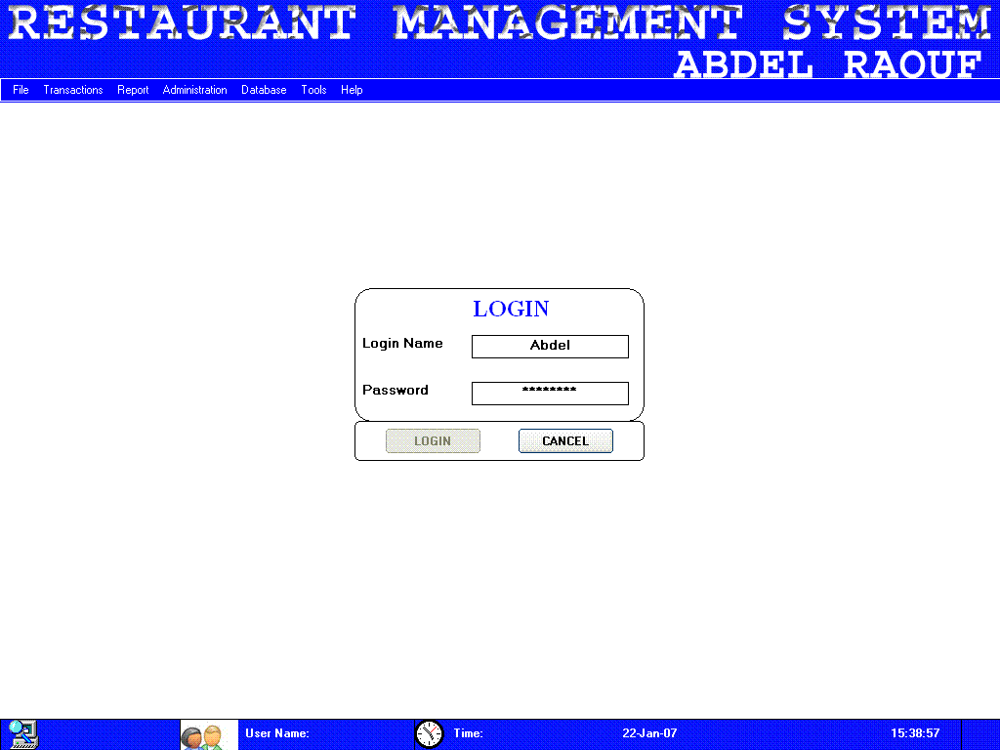



## Restaurant Management System

### Description

This an update of the Restaurant Management System that I developed for a Restaurant in country as a project when I was schooling.

It has many features and i would like to submit it to the whole world to give me feedback.

Please i need your support and don't fail to vote for me.

The best is yet to come.

NB:

Please register the 2 Controls from the folder called 'OCX Controls'
 
### More Info
 
NB:

Please register the 2 Controls from the folder called 'OCX Controls'

             |
---                |---
**Submitted On**   |2007-03-14 08:51:26
**By**             |[YESSOUFOU ABDEL RAOUF](https://github.com/Planet-Source-Code/PSCIndex/blob/master/ByAuthor/yessoufou-abdel-raouf.md)
**Level**          |Intermediate
**User Rating**    |4.4 (80 globes from 18 users)
**Compatibility**  |VB 6\.0, VBA MS Access
**Category**       |[Complete Applications](https://github.com/Planet-Source-Code/PSCIndex/blob/master/ByCategory/complete-applications__1-27.md)
**World**          |[Visual Basic](https://github.com/Planet-Source-Code/PSCIndex/blob/master/ByWorld/visual-basic.md)
**Archive File**   |[Restaurant2054493182007\.zip](https://github.com/Planet-Source-Code/yessoufou-abdel-raouf-restaurant-management-system__1-67709/archive/master.zip)

